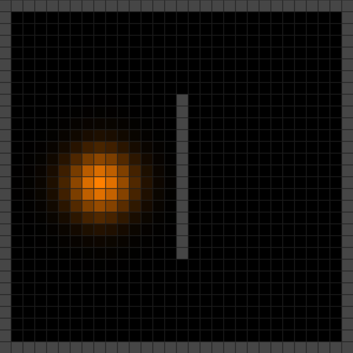

# HeatEquation-JS :fire:
Solving heat equation in R^2

## Formal definition
In mathematics, if given an open subset **U** of **R^n** (R^3 in this definition) and a subinterval **I** of **R**, one says that a function **u : U × I → R** is a solution of the heat equation if 

where **(x, y, z, t)** denotes a general point of the domain. It is typical to refer to **t** as "time" and **x**, **y**, **z** as "spatial variables," even in abstract contexts where these phrases fail to have their intuitive meaning. For any given value of **t**, the right-hand side of the equation is the Laplacian of the function **u(⋅, t) : U → R**.

in which **α** is a positive coefficient called the thermal diffusivity of the medium

### Discretizing heat equation
Use the 2D heat equation and discretize it using **finite differences** (Taylor series aproximation)

The final discrete form of the heat equation:

## Examples
<table>
  <tr>
    <td></td>
    <td></td>
  </tr>
</table>
